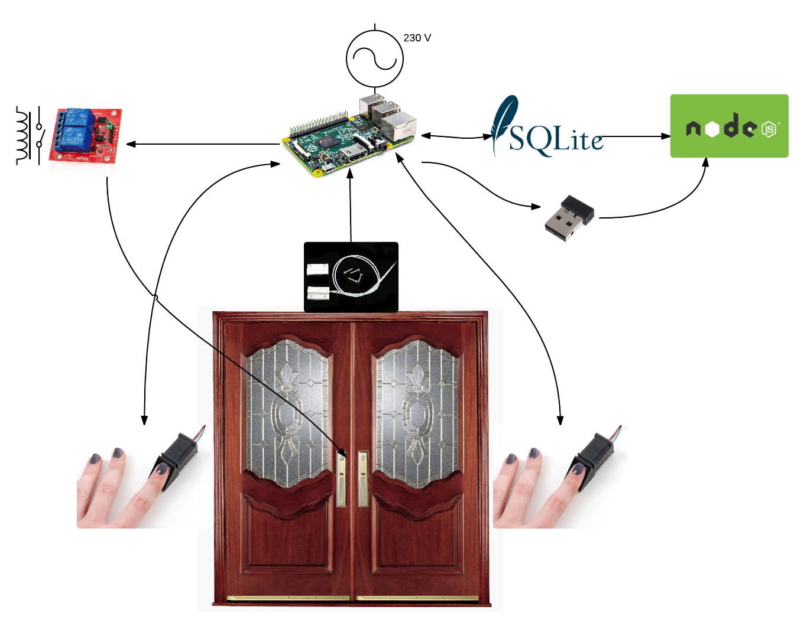

# Fingerprint porter & attendance system

A porter & attendance system based on Raspberry Pi 2 Model B. It uses two Adafruit’s fingerprint modules, a door switch and one relay to control the door lock. The system opens a door based on the user fingerprint detection, and it’s able to detect the door status. The readers are synchronized with sqlite database.

The system stores the user attendance into a sqlite database and via a rest Node.js server running on wifi interface provides the access to it. However, there is no way to get a fingerprint from the internet or by breaking the wifi. 
